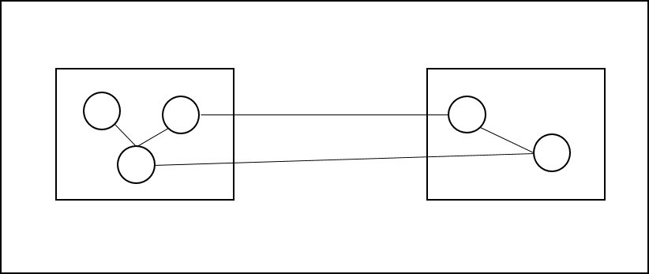
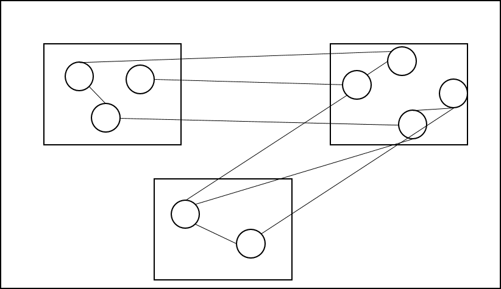
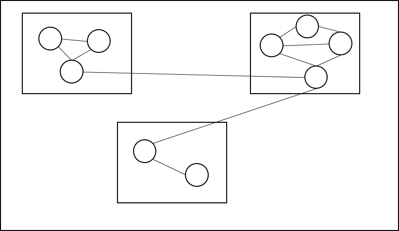

# Modularität
            
*Wir haben gesehen, dass das Prinzip der Modularität eine zentrale Rolle im Software Engineering einnimmt. In diesem Artikel wollen wir einige allgemeine
Aspekte von Modularität diskutieren.*            

## Top down vs Bottom up
Modularität erlaubt es uns, das Prinzip des "Teilen der Verantwortlichkeiten" in zwei Phasen durchzuführen: 

1. Das Ausarbeiten der Details eines Moduls (und unter vernachlässigung der Details anderer Module)
2. Das Integrierung der Module in ein Gesamtes, unter Berücksichtigung der Beziehungen zwischen den Modulen

Wenn diese zwei Phasen so nacheinander ausgeführt werden, spricht man von einem *Bottom up* Design. Wenn diese Phasen in umgekehrter Reihenfolge 
ausgeführt werden, spricht man von einem *Top Down* design.

## Dekomposition und Komposition
Modularität führt in der Praxis zu 4 wichtigen Vorteilen:

1. Die Möglichkeit, ein System in einfachere Teile zu zerlegen
2. Die Möglichkeit, ein System aus einfacheren Teilen zusammenzubauen (lego)
3. Die Möglichkeit, ein System nicht als ganzes, sondern in kleinen Blöcken verstehen zu können. 
4. Die Möglichkeit, ein System zu verändern, indem nur ein kleiner Teil (ein Modul) verändert wird. 

## Kopplung und Bindung

Damit wir in einem System diese Möglichkeiten der Modularität erhalten, ist unser Designziel, eine möglichst
schwache *Kopplung* der Module, sowie eine möglchst starke Binding (oder Kohäsion) innerhalb der Module zu erreichen. 

* Kopplung: Wie stark sind die Module verknüpft?
* Bindung: Wie gut bilden die Module eine logische Einheit?

Ein Beispiel eines System mit starker Kopplung zwischen den Modulen und einer schwachen Bindung ist in der nächsten Abbildung dargestellt.
                    
Dem Gegenüber steht ein Design bei dem die Module schwach gekoppelt sind, jedoch die Module eine starke Bindung aufweisen. 

Der erste Fall ist offensichtlich besser. Durch die lose Kopplung gibt es weniger Abhängigkeiten zwischen den Modulen, wodurch eine Änderung an 
einem einzelnen Modul viel weniger Auswirkungen auf die anderen Module hat. Auch erleichtert die Lose Kopplung das Testen der Module, da nicht viele 
Abhängigkeiten simuliert werden müssen. 

Eine starke Bindung innerhalb eines Moduls ist ein indiz dafür, dass das Modul nur genau für eine Aufgabe verantwortlich ist. Dies erleichtert das Verstehen des Moduls erheblich. 
  